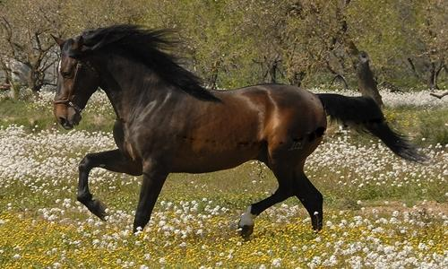

Jaslider
========

#English redaction


Jaslider.js is an slider plugin for jquery , this plugin can have an gallery with thumbnails or not to animate the images.

Tested with: IE8+ , Chrome 29.0.1547.76 and Mozillla Firefox; Using jquery-1.9

## How work?
1- Include jquery file and plugin Jaslider.js  and css stylesheet called "Jastyles.css"

2- Create an div with id E.g : ``` <div id="gallery"></div>``` 

3- Create an elements list on gallery div and put the images on ``` <li></li>``` 

4- Then instantiate the plugin with javascript

`````javascript
$("#gallery").JaGallery( {
         height: 300, 
         width: 500,
         sliderTime: 1200
});
`````

5- Ready !


## For use of thumbnails  

1- Set at "true" the element thumbs
`````javascript
 $("#gallery").JaGallery( { thumbs:true } );
 `````

2- Add ``` <ul> ``` list in the file and set as id="thumbnails" 

3- Ready!


### Examples Folder:
There are two .html files with examples.

example1.html (Simple slider without thumbnails images)
example2.html (Slider Gallery with thumbnails images)


=========

# Redacción en Español


Jaslider.js es un plugin para jQuery slider, este plugin puede tener una galería con imágenes en miniatura o no animar las imágenes.

Testeado en: IE8, Chrome 29.0.1547.76 y Mozilla Firefox; Usando jquery-1.9

## ¿Cómo funciona?

1 - Incluir archivo jquery y Jaslider.js plugin y hoja de estilo css llamado "Jastyles.css"

2 - Crear un div con id Ejemplo:
```
<div id="gallery"></div>
```

3 - Crear una lista de elementos en la galería div y poner las imágenes en los elementos ``` <li></li>``` 

4 - A continuación, una instancia del plugin con javascript
`````javascript
$ ("#gallery").JaGallery({
         height: 300,
         width: 500,
         sliderTime: 1200
});
`````
5 - Listo!


## Para el uso de imágenes en miniatura

1 - Crear y setear en "true" el elemento "thumbs" del objeto 
`````javascript
$("#galería").JaGallery({ thumbs: true });
`````

2 - Crear un div con id = "thumbnails" y añadirle una lista ``` <ul> ``` de la misma forma que hicimos antes Por ejemplo:
```
<div id="thumbnails">
  <ul>
    <li></li>
    <li></li>
    <li></li>
    <li></li>
    <li></li>
    <li></li>

  </ul>
</div>

```
3 - Listo!

### Carpeta Ejemplos:
Hay 2 archivos .HTML con ejemplos.

example1.html (slider simple sin imágenes miniatura)

example2.html (galería deslizante con miniaturas de imágenes)


==========

#Parameters / Parámetros
`````javascript
width // (Required) Width of slider (Integer)
height // (Required) Height of the Slider (Integer)
thumbs // Set at true to use the thumbnails (Boolean)
infinite // Set at true to repeat slider effect (Boolean)
easing // Set any value of the plugin to run the slider with effects (String)
sliderTime // (Required) Set value to time images transitions (Integer)
`````
